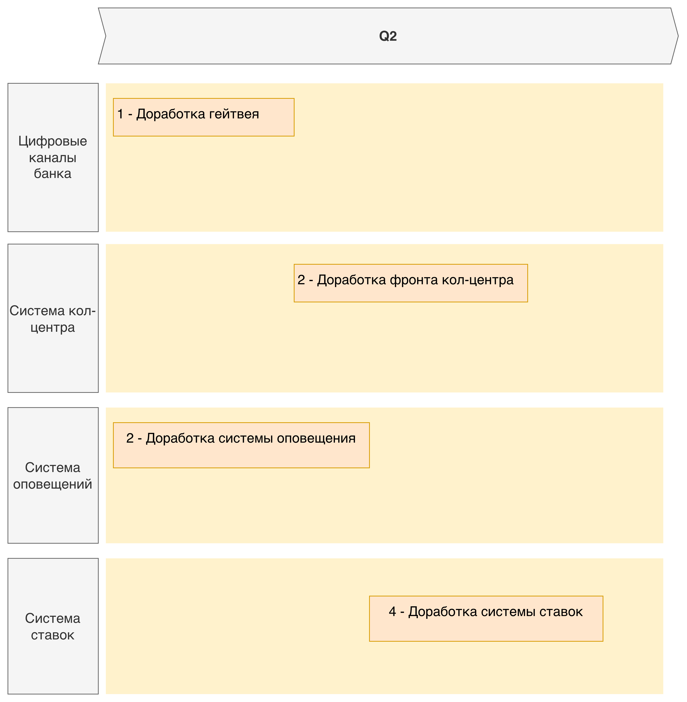

### **Название задачи:** Передача ставок в кол-центр
### **Автор:** Даниил Маркелов
### **Дата:** 06.07.2026

### **Функциональные требования**

| **№** | **Действующие лица или системы** | **Use Case** | **Описание** |
| :-: | :- | :- | :- |
| T4-UC-01 | Оператор кол-центра банка; Веб-интерфейс кол-центра; Гейтвей цифровых каналов; Кеш цифровых каналов; Сервис ставок | Консультация клиента по депозитным ставкам в кол-центре банка | 1. Клиент звонит в кол-центр банка и уточняет условия по депозиту. 2. Оператор открывает карточку клиента или обращение в веб-интерфейсе кол-центра. 3. Фронт кол-центра напрямую запрашивает ставки в гейтвее цифровых каналов, без доработки бэкенда кол-центра. 4. Гейтвей отдает общие ставки по уже существующему механизму, который используется сайтом банка. 5. Если нужны персонализированные условия, фронт кол-центра вызывает внутренний API гейтвея для кол-центра. 6. Гейтвей получает готовые персонализированные ставки из сервиса ставок и возвращает их фронту кол-центра. 7. Оператор видит общие и персонализированные ставки с датой актуальности и консультирует клиента. |
| T4-UC-02 | Менеджер бэк-офиса депозитов; Сервис ставок; БД сервиса ставок; Kafka; Гейтвей цифровых каналов; Кеш цифровых каналов | Публикация актуальной версии ставок для консультаций | 1. Менеджер бэк-офиса загружает или обновляет ставки в сервисе ставок по процессу MVP. 2. Сервис ставок сохраняет новую версию, историю изменений и признак опубликованной версии. 3. После публикации сервис ставок отправляет событие обновления ставок в Kafka. 4. Гейтвей цифровых каналов обновляет кеш общих ставок по механизму ADR_MVP. 5. Система кол-центра при следующем запросе получает актуальную опубликованную версию общих ставок из существующего API и персонализированные ставки через внутренний API гейтвея. |
| T4-UC-03 | Сервис ставок; БД сервиса ставок; Сервис оповещений; Корпоративная почта банка; Система партнерского кол-центра; Оператор партнерского кол-центра | Передача файла ставок партнерскому кол-центру | 1. По расписанию сервис ставок запускает формирование файла. 2. Если ставки еще не обновлены, то формирование файла откладывается. 3. Сервис ставок вызывает сервис оповещений по REST и передает файл со ставками и версию ставок. 4. Сервис оповещений отправляет email с файлом через корпоративную почту банка на адрес партнерского кол-центра. 5. Сервис оповещений фиксирует технический статус отправки. 6. Партнерский кол-центр использует полученный файл в своем внешнем процессе консультаций. |

### **Нефункциональные требования**

| **№** | **Код** | **Требование** |
| :-: | :-: | :- |
| 1 | T4-F1 | Система кол-центра банка должна показывать оператору общие депозитные ставки и персонализированные условия, если клиент идентифицирован и данные для персонализации доступны. |
| 2 | T4-F2 | Фронт кол-центра должен получать ставки напрямую из гейтвея цифровых каналов. Прямые обращения к АБС, БД АБС, БД сервиса ставок и кешу запрещены. |
| 3 | T4-F3 | Гейтвей должен переиспользовать существующую логику выдачи общих ставок. |
| 4 | T4-F4 | Сервис ставок должен формировать файл для партнерского кол-центра с общими и персонализированными ставками в согласованном формате и передавать его в сервис оповещений по REST. |
| 5 | T4-F5 | Email-адрес партнерского кол-центра и шаблон письма должны настраиваться в сервисе оповещений и изменяться без релиза кода. |
| 6 | T4-F6 | Сервис оповещений должен поддерживать отправку email с вложением, журналировать технический статус доставки и возвращать результат в сервис ставок. |
| 7 | T4-R1 | Консультация в кол-центре не должна увеличивать нагрузку на АБС. Все read-запросы идут через гейтвей цифровых каналов, кеш общих ставок и сервис ставок. |
| 8 | T4-R2 | При недоступности сервиса ставок гейтвей должен продолжать отдавать последнюю опубликованную версию общих ставок из кеша с явной датой актуальности. |
| 9 | T4-R3 | Персонализированные ставки не должны сохраняться в БД кол-центра как источник истины. В карточке обращения допустимо хранить только факт консультации, версию ставки и ссылку на клиентский контекст. |
| 10 | T4-R4 | В файле партнеру можно передавать только данные, согласованные для внешнего кол-центра. Персональные данные клиента в файл не включаются, если нет отдельного юридического основания и процесса защиты данных. |
| 11 | T4-R5 | Изменения должны укладываться в MVP и переиспользовать архитектуру ADR_MVP: гейтвей, кеш цифровых каналов, сервис ставок, сервис оповещений и существующую платформу кол-центра. |

### **Решение**

Решение расширяет ADR_MVP и не вводит новый канал доступа к АБС. Для внутреннего кол-центра дорабатывается только фронт системы кол-центра: оператор получает ставки в карточке обращения, а React-фронт напрямую обращается к гейтвею цифровых каналов. Это быстрее для MVP, потому что не требует доработки Java-бэкенда платформы кол-центра и привлечения подрядчика. Гейтвей отдает общие ставки по уже существующему механизму, который используется сайтом банка, добавляя внутренний эндпоинт для получения персонализированных ставок.

Для партнерского кол-центра API не проектируется, потому что внешняя система партнера готова принимать только файлы и не поддерживает API/SFTP-вызовы. В сервис ставок добавляется задача экспорта: она формирует файл по опубликованной версии общих и допустимых для передачи персонализированных ставок. Сервис ставок вызывает сервис оповещений по REST и передает файл со ставками. Email-адрес получателя, тема и шаблон письма настраиваются в сервисе оповещений, потому что отправка сообщений и ведение статусов доставки относятся к его зоне ответственности. Сервис ставок фиксирует бизнес-статус передачи, сервис оповещений фиксирует технический статус email-доставки.

Диаграммы:

- [C4 Context: ставки для кол-центров](c4-context-call-center-rates-mvp.puml)
- [C4 Container: ставки для кол-центров](c4-container-call-center-rates-mvp.puml)

#### Крупные задачи для планирования

[Исходник RoadMap в draw.io](RoadMap_rates.drawio)

| № | Крупная задача | Зависимости |
| :-: | :- | :- |
| 1 | Доработка гейтвея | Нет |
| 2 | Доработка фронта кол-центра | Доработка гейтвея |
| 3 | Доработка системы оповещений | Нет |
| 4 | Доработки сервиса ставок | Доработка системы оповещений |

#### Доработки системы кол-центра банка

- Добавить в веб-интерфейс кол-центра блок просмотра депозитных ставок в карточке клиента или обращения.
- Добавить во фронт кол-центра прямой вызов гейтвея цифровых каналов для запроса ставок.
- Передавать на фронт дату актуальности, тип ставки и признак персонализации.
- Не сохранять расчет ставки как мастер-данные в БД кол-центра.
- Бэкенд кол-центра в MVP не дорабатывать, чтобы не привлекать подрядчика платформы.

#### Доработки гейтвея и кеша цифровых каналов

- Переиспользовать существующую логику получения общих ставок, которая уже работает для сайта банка.
- Добавить внутренний API для фронта кол-центра, который отдает все персонализированные ставки.
- Для персонализированных ставок обращаться к сервису ставок, где уже есть информация, используемая цифровыми каналами в ADR_MVP.
- Возвращать последнюю опубликованную версию общих ставок при временной недоступности сервиса ставок.

#### Доработки сервиса ставок

- Добавить формирование файла ставок для партнерского кол-центра.
- Отдавать гейтвею готовые персонализированные ставки, которые уже используются цифровыми каналами в ADR_MVP.
- Вызывать сервис оповещений по REST и передавать файл со ставками и версию ставок.
- Хранить бизнес-статус передачи файла и идемпотентность по версии ставок.
- Публиковать события обновления ставок для актуализации кеша цифровых каналов, как в ADR_MVP.

#### Доработки системы оповещений

- Добавить отправку email с вложением через корпоративную почту банка.
- Добавить REST-контракт приема файла ставок от сервиса ставок: файл, версия ставок и идемпотентный ключ.
- Хранить email-адрес партнерского кол-центра, тему и шаблон письма в настройках сервиса оповещений.
- Журналировать технический статус email-отправки, ошибку доставки и результат повторной отправки.
- Возвращать сервису ставок результат отправки или публиковать событие о результате доставки.

#### Система счетов

- Не требуются в рамках Task 4.
- В сервисе ставок уже есть информация по персонализированным ставкам, которая отдается цифровым каналам в рамках ADR_MVP.

#### Матрица трейсинга требований

| Требование | Покрытие в решении | Основные компоненты |
| :- | :- | :- |
| T4-F1 | Ставки отображаются в карточке клиента или обращения | Веб-интерфейс кол-центра |
| T4-F2 | Фронт кол-центра интегрируется напрямую с гейтвеем | Веб-интерфейс кол-центра, гейтвей цифровых каналов |
| T4-F3 | Общие ставки отдаются существующим механизмом, персональные - через внутренний API гейтвея | Гейтвей, кеш цифровых каналов, сервис ставок |
| T4-F4 | Файл формируется в сервисе ставок и передается на отправку в сервис оповещений | Сервис ставок, задача экспорта ставок, сервис оповещений |
| T4-F5 | Email партнера и шаблон письма параметризованы | БД/конфигурация сервиса оповещений |
| T4-F6 | Техническая email-отправка и статусы доставки журналируются в сервисе оповещений | Сервис оповещений, БД сервиса оповещений, сервис ставок |
| T4-R1 | АБС не участвует в консультационных read-запросах | Гейтвей, кеш, сервис ставок |
| T4-R2 | Деградация на последнюю опубликованную версию | Гейтвей, кеш цифровых каналов |
| T4-R3 | Кол-центр не становится источником ставок | БД кол-центра хранит только обращение и ссылку на версию |
| T4-R4 | Внешнему партнеру передается только разрешенный набор данных | Сервис ставок, формат файла, сервис оповещений |
| T4-R5 | Переиспользуется архитектура MVP | Гейтвей, кеш цифровых каналов, сервис ставок, сервис оповещений, система кол-центра |

### **Альтернативы**

#### Интеграция партнерского кол-центра через API или SFTP

Плюс: лучше контролируется доставка и формат обмена.

Минусы: по условию партнер не готов к API-вызовам, включая SFTP. Альтернатива не подходит для MVP.

#### Прямая отправка email из сервиса ставок

Плюс: меньше систем участвует в цепочке отправки файла партнеру.

Минусы: сервис ставок начинает отвечать за техническую доставку сообщений, SMTP-интеграцию, статусы доставки и повторные отправки. Это нарушает границы ответственности: сервис ставок должен управлять ставками и формировать файл, а отправка сообщений должна оставаться в системе оповещений. Альтернатива отклонена.

#### Отправлять файл партнеру вручную из бэк-офиса

Плюс: минимальная техническая реализация.

Минусы: высокий операционный риск, нет автоматического журнала отправки, возрастает вероятность отправки устаревших ставок. Альтернатива отклонена, потому что ставка должна быть актуальной при росте нагрузки на кол-центры.

### **Недостатки, ограничения и риски**

- Email не дает такого же уровня управляемости доставки, как API или SFTP. Для MVP это принимается из-за ограничений партнера, но нужна фиксация статуса отправки в сервисе оповещений и регламент ручной проверки при ошибке.
- Процесс передачи персонализированных ставок для партнера должен быть ограничен соглашениями на уровне бизнеса. Передача клиентских персональных данных во внешний кол-центр требует отдельного юридического процесса.
- При недоступности сервиса ставок оператор банка увидит только кешированную опубликованную версию общих ставок. Персонализированные условия в этот момент нужно помечать как временно недоступные.
- Система кол-центра является платформой подрядчика. В MVP дорабатывается только фронт кол-центра; если для доступа к гейтвею потребуется изменение backend-настроек безопасности платформы, это станет риском сроков.
